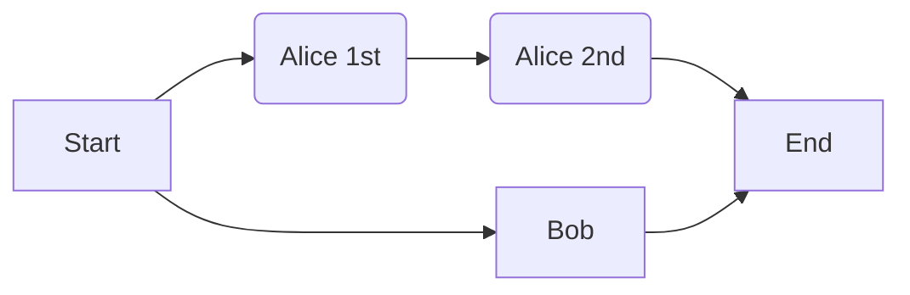

# When Git Fails Silently

Imagine your codebase looks like this:

```
line 1
line 2
```

Your coworkers, `Alice` and `Bob`, each submit a pull request on their respective branch.

## Alice

The [PR of `Alice`](https://github.com/andreasfelix/when-git-fails/pull/1) includes two commits:

* In the first commit, she adds her own name to the top of the file:

```diff
+ alice
line 1
line 2
```

* In the second commit, she copies `line 1` and `line 2` above the existing code:

```diff
+ line 1
+ line 2
alice
line 1
line 2
```

## Bob

[`Bob`'s PR](https://github.com/andreasfelix/when-git-fails/pull/2) consists of a single commit where he adds his name in between the existing code:

```diff
line 1
+ bob
line 2
```

## Code Review

You are tasked with reviewing the PRs from [`Alice`](https://github.com/andreasfelix/when-git-fails/pull/1) and [`Bob`](https://github.com/andreasfelix/when-git-fails/pull/2).

You inspect the `diff` for both PRs by clicking on *Files changed*. At first glance, everything seems fine. After merging both PRs, you anticipate the code to appear as follows:

```
line 1
line 2
alice
line 1
bob
line 2
```

However, contrary to your expectations, the code looks like this:

```
line 1
bob
line 2
alice
line 1
line 2
```

## What Happened?

Git uses a [three-way-merge](https://en.wikipedia.org/wiki/Merge_(version_control)#Three-way_merge) strategy (more precisely the [`ort` strategy](https://git-scm.com/docs/merge-strategies#Documentation/merge-strategies.txt-ort)), which does not consider intermediate commits. It analyzes the differences between the latest commits of the two commit histories and their common ancestor commit.



So in our case, it will only compare the 2nd commit of `Alice` with the one of `Bob` and doesn't take into consideration the first commit of `Alice`. The information on how she arrived at a specific version of the code is lost.

Specifically, both `Alice`'s 2nd commit and the common ancestor begin with:

```
line 1
line 2
```

Meanwhile, `Bob`'s file starts with:

```
line 1
bob
line 2
```

Consequently, Git opts for `Bob`'s section of the code. During the subsequent step, while `Bob` and the common ancestor share an empty section, `Alice`'s version contains:

```
alice
line 1
line 2
```

Hence, Git selects `Alice`'s section in this instance. This results in the final code looking as follows:

```
line 1
bob
line 2
alice
line 1
line 2
```

## How Can You Prevent This?

To avoid this issue, use GitHub's options to always update your branch before merging:

#### Settings > General > Pull Requests


#### Settings > Branches > Protection Rules


> **Note**
> While this doesn't prevent Git from merging "incorrectly," this method allows you to identify errors before merging into your `main` branch. Therefore, you can notice the error when inspecting the diff (*Files changed*) and your CI would be capable of detecting them.

## References

This entire repository is based on an example presented in [this talk](https://www.youtube.com/watch?v=7MpdZkGj5AI&t).
